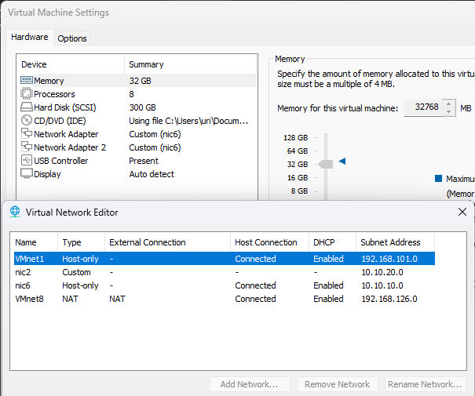

# Lab 1B Sub: Chuẩn bị cho kiểm thử HA/DRS

## I. Yêu cầu và cách thức hoạt động

### 1. Mục tiêu triển khai Cluster (HA + DRS)

| Tính năng                            | Mục đích                                                       |
| ------------------------------------ | -------------------------------------------------------------- |
| **HA (High Availability)**           | Tự động khởi động lại VM trên host khác khi một host bị lỗi.   |
| **DRS (Dynamic Resource Scheduler)** | Cân bằng tải CPU/RAM giữa các host thông qua vMotion.          |
| **vMotion / Storage vMotion**        | Di chuyển VM giữa các host (hoặc datastore) mà không downtime. |

### 2. Thiết bị và hạ tầng cần có

| Thành phần                              | Số lượng / yêu cầu tối thiểu     | Mô tả                                                                         |
| --------------------------------------- | -------------------------------- | ----------------------------------------------------------------------------- |
| **1. vCenter Server (Appliance)**       | 1 máy ảo                         | Trung tâm quản lý Cluster, DRS, HA, vMotion, Datastore.                       |
| **2. ESXi Host**                        | ≥ 2 host vật lý                  | Cần tối thiểu 2 host để DRS và HA hoạt động.                                  |
| **3. NIC vật lý (Physical NIC)**        | ≥ 4 NIC mỗi host (khuyến nghị)   | Phân tách traffic: Management, vMotion, vSAN, VM Network.                     |
| **4. Shared Storage (Datastore chung)** | Bắt buộc                         | Tất cả host phải truy cập được **cùng một Datastore** (iSCSI, NFS hoặc vSAN). |
| **5. VLAN & Switch Layer 2/3**          | VLAN riêng cho từng loại traffic | VLAN Management, vMotion, vSAN, VM Network.                                   |
| **6. DNS Server / NTP Server**          | Có                               | vCenter và các host cần DNS phân giải 2 chiều (FQDN) và đồng bộ giờ NTP.      |
| **7. License VMware**                   | vSphere Standard trở lên         | DRS cần **Enterprise Plus**, HA cần **Standard** trở lên.                     |

### 3. Mạng và VLAN

| Loại traffic           | VLAN riêng | Giao thức / yêu cầu                      |
| ---------------------- | ---------- | ---------------------------------------- |
| **Management Network** | VLAN10     | vCenter ↔ ESXi (SSH, API, HA heartbeat)  |
| **vMotion Network**    | VLAN20     | VMkernel riêng, MTU ≥ 9000 (Jumbo Frame) |
| **vSAN Network**       | VLAN30     | Multicast/Unicast, MTU ≥ 9000            |
| **VM Network**         | VLAN40+    | Các VLAN của VM (App, DB, Frontend,...)  |

### 4. Cách HA hoạt động

**Quy trình hoạt động:**
1. vCenter bật HA cho cluster → tạo FDM Agent (Fault Domain Manager) trên mỗi host
2. Các host gửi heartbeat qua management network (hoặc datastore)
3. Khi 1 host không phản hồi trong X giây (default: 15s), cluster đánh giá:
   - Nếu host chết thực sự, các VM của nó sẽ được khởi động lại trên host còn sống
   - Nếu chỉ mất kết nối tạm thời, HA sẽ không di chuyển VM

## II. Triển khai vSS/vDS và Shared Storage (vSAN) sử dụng cho HA/DRS

### 1. Triển khai dịch vụ mạng và VLAN 

**Lưu ý:** Tham khảo phần [3. Mạng và VLAN](#3-mạng-và-vlan) để biết các cấu hình VLAN cần thiết.

## III. Migrate vSS to vDS (Bonus: vmk0 vSS to DPG-MGMT vDS)

> Di chuyển chỉ vmk0 (Management IP) từ vSwitch0 (vSS) sang vDS-Cluster → DPG_10.10.10.0_prefix24, dùng cùng subnet 10.10.10.0/24.
> (giữ nguyên IP/Netmask/Gateway, không đổi VLAN nếu lab không có trunk).

### 1. Chuẩn bị mạng dự phòng

**Yêu cầu:** ESXi cần 2 NIC (network adapter) khác nhau nhưng cùng một dải mạng để có đường dự phòng khi chuyển đổi từ vSS sang vDS.

#### Trường hợp không có mạng dự phòng
- Khi chuyển vCenter từ vSS sang dùng mạng vDS, kết nối có thể bị ngắt ngay lập tức.
- Hệ quả: Không thể tiếp tục migrate ESXi sang sử dụng vDS.

#### Trường hợp có mạng dự phòng
- Với vDS: `vmnic1` gắn vào `Uplink1`, `Uplink1` gắn vào `DPG-MGMT` → hình thành tuyến tương đương với tuyến từ `vmnic0` đến `VM Network` (đường dự phòng an toàn khi chuyển đổi).

**Các bước thực hiện:**
1. Tạo `vDS-Cluster` (Distributed Switch): vCenter → Networking → Datacenter → Right-Click → Distributed Switch → New Distributed Switch → Name: `vDS-Cluster` → Chọn version của bạn → Next → Uncheck `Create a default port group` → Finish.
2. Tạo `DPG-MGMT` (Distributed Port Group): vCenter → Networking → Datacenter → `vDS-Cluster` → Right-Click → Distributed Port Group → New Distributed Port Group → Name: `DPG-MGMT` → Next → Check `Customize default policies configuration` → Next → Next → Next → (Nếu có) chuyển `Uplink2, Uplink3, Uplink4` xuống `Unused uplinks` → Next → Next → Next → Finish.
3. Gắn `vDS-Cluster` vào ESXi (Add and Manage Hosts): vCenter → Networking → Datacenter → `vDS-Cluster` → Right-Click → Add and Manage Hosts → Add hosts → chọn host cần chuyển qua `DPG-MGMT` → Next → tại cột `Assign Uplink` của `vmnic1`, chọn `Uplink1` (trùng với uplink đang Active của `DPG-MGMT`) → Next các bước còn lại (không đổi cấu hình) → Finish.
4. Chuyển mạng của vCenter từ `VM Network` → `DPG-MGMT`: vCenter → VMs and Templates → Datacenter → chọn VM vCenter (vị trí mặc định: `Discovered virtual machine`) → Right-Click → Edit Settings → `Network Adapter 1` → Browse → chọn `DPG-MGMT` → OK → OK.
5. Chuyển mạng của ESXi từ `VM Network` → `DPG-MGMT`: vCenter → Networking → Datacenter → `vDS-Cluster` → Right-Click → Add and Manage Hosts → Add hosts → chọn host cần chuyển qua `DPG-MGMT` → thực hiện migrate như hướng dẫn.