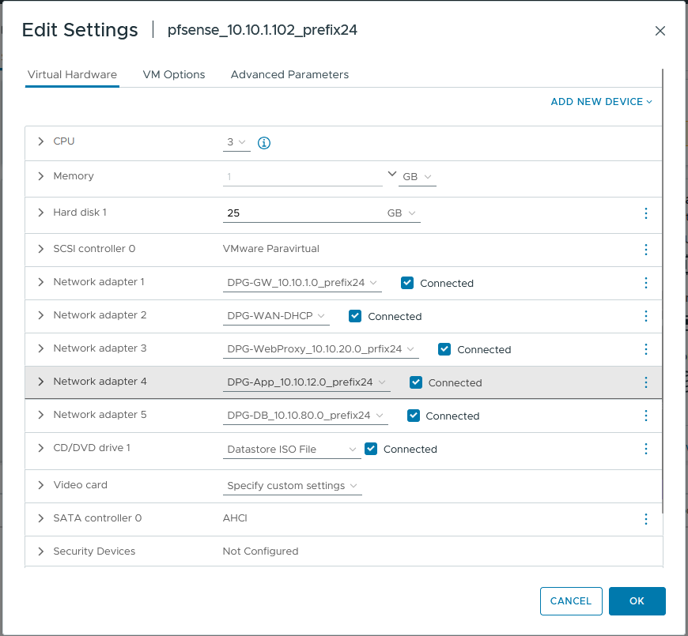
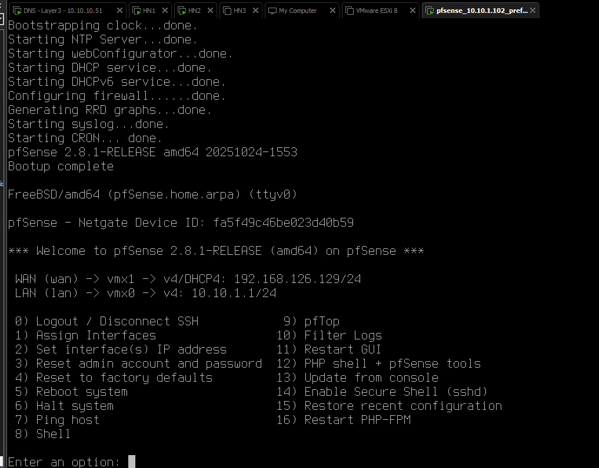
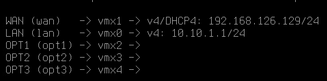

https://www.howtoforge.com/how-to-install-openemr-on-ubuntu-24-04-server/


## 🧩 **I. Sơ đồ mạng tổng thể – bản cập nhật (đúng với vDS hiện tại)**

| Zone / Network | Chức năng                      | Subnet        | pfSense Interface IP       | Gợi ý VM IP | Mô tả                                      |
| -------------- | ------------------------------ | ------------- | -------------------------- | ----------- | ------------------------------------------ |
| **WAN-DHCP**   | Internet access                | DHCP / VMNet8 | DHCP (ví dụ 192.168.198.x) | —           | pfSense ra Internet, cập nhật package      |
| **GW**         | pfSense LAN core               | 10.10.1.0/24  | 10.10.1.1                  | —           | pfSense nội bộ – route giữa các zone       |
| **WebProxy**   | Reverse Proxy (Nginx + SSL)    | 10.10.20.0/24 | 10.10.20.1                 | 10.10.20.10 | Nhận HTTPS từ client, chuyển tiếp sang App |
| **App**        | PHP-FPM + OpenEMR logic        | 10.10.12.0/24 | 10.10.12.1                 | 10.10.12.10 | Xử lý request, kết nối DB                  |
| **DB**         | MariaDB                        | 10.10.80.0/24 | 10.10.80.1                 | 10.10.80.10 | Lưu dữ liệu EMR                            |
| **MGMT**       | Quản trị ESXi, backup, monitor | 10.10.10.0/24 | 10.10.10.1                 | 10.10.10.10 | Quản lý, SSH, cron                         |

---

## ⚙️ **II. Mapping network trong ESXi / vDS**

| vDS PortGroup                        | Gán cho VM                              | Subnet        | Dạng kết nối           | Ghi chú               |
| ------------------------------------ | --------------------------------------- | ------------- | ---------------------- | --------------------- |
| **DPG-GW_10.10.1.0_prefix24**        | pfSense (NIC1)                          | 10.10.1.0/24  | Internal route         | LAN gateway           |
| **DPG-WAN-DHCP**                     | pfSense (NIC2)                          | DHCP / VMNet8 | External (ra Internet) | WAN                   |
| **DPG-WebProxy_10.10.20.0_prefix24** | pfSense (NIC3), VM1                     | 10.10.20.0/24 | Internal               | Reverse Proxy network |
| **DPG-App_10.10.12.0_prefix24**      | pfSense (NIC4), VM2                     | 10.10.12.0/24 | Internal               | App layer             |
| **DPG-DB_10.10.80.0_prefix24**       | pfSense (NIC5), VM3                     | 10.10.80.0/24 | Internal               | Database layer        |
| **DPG-MGMT_10.10.10.0_prefix24**     | pfSense (NIC6), VM4, vCenter, ESXi host | 10.10.10.0/24 | Internal               | Quản lý               |

> 👉 pfSense có 6 NIC tương ứng 6 DPG ở trên.
> Các VM Web/App/DB/MGMT chỉ gắn vào đúng DPG tương ứng với zone của chúng.

---

## 🔧 **III. Cấu hình pfSense – từng bước chi tiết**

### 1️⃣ Trong trình cài đặt (Installer)

Chọn cài bình thường → “Auto (UFS)” → hostname `pfsense.lab.local`
Sau khi reboot:

### 2️⃣ Gán Interface:

Khi pfSense hỏi:

```
Enter WAN interface: em0  → DPG-WAN-DHCP
Enter LAN interface: em1  → DPG-GW_10.10.1.0_prefix24
Add another interface? [y/n]: y
```

Thêm:

* `em2` → DPG-WebProxy_10.10.20.0_prefix24
* `em3` → DPG-App_10.10.12.0_prefix24
* `em4` → DPG-DB_10.10.80.0_prefix24
* `em5` → DPG-MGMT_10.10.10.0_prefix24

Hoàn tất:
`WAN = em0`, `GW = em1`, `WEB = em2`, `APP = em3`, `DB = em4`, `MGMT = em5`.

### 3️⃣ Cấu hình IP cho từng interface

Vào Console (option 2 – Assign IP):

| Interface | IP/Subnet     | Gateway | DHCP  |
| --------- | ------------- | ------- | ----- |
| WAN       | DHCP          | Tự động | Có    |
| GW        | 10.10.1.1/24  | —       | Không |
| WebProxy  | 10.10.20.1/24 | —       | Không |
| App       | 10.10.12.1/24 | —       | Không |
| DB        | 10.10.80.1/24 | —       | Không |

Tắt DHCP trên tất cả trừ WAN (chỉ pfSense quản lý gateway).

---

## 🔐 **IV. Cấu hình trong WebGUI pfSense**

Truy cập:
`https://10.10.1.1` (qua network GW)

### 1️⃣ NAT Outbound

* Chuyển sang **Manual Outbound NAT**
* Thêm rule cho từng network (Web/App/DB/MGMT) → Interface: WAN → Translation: Interface address
  → Mục đích: Cho phép các subnet nội bộ ra Internet (apt, update, certbot).

### 2️⃣ Firewall Rules

| From           | To     | Port  | Action            | Description |
| -------------- | ------ | ----- | ----------------- | ----------- |
| WAN → WebProxy | 80,443 | ALLOW | Public access     |             |
| WebProxy → App | 9000   | ALLOW | Nginx → PHP-FPM   |             |
| App → DB       | 3306   | ALLOW | OpenEMR ↔ MariaDB |             |
| DB → any       | *      | DENY  | Tăng bảo mật      |             |

---

## 🧱 **V. Cấu hình IP static trên các VM**

| VM                 | Zone     | IP          | Gateway    | DNS     |
| ------------------ | -------- | ----------- | ---------- | ------- |
| **VM1 – WebProxy** | WebProxy | 10.10.20.10 | 10.10.20.1 | 8.8.8.8 |
| **VM2 – App**      | App      | 10.10.12.10 | 10.10.12.1 | 8.8.8.8 |
| **VM3 – DB**       | DB       | 10.10.80.10 | 10.10.80.1 | 8.8.8.8 |

---

## 🌐 **VI. Dòng kết nối OpenEMR**

```
Client (Browser)
     ↓ HTTPS 443
pfSense (WAN → NAT → WEB)
     ↓
WebProxy (Nginx + SSL) 10.10.20.10
     ↓ FastCGI 9000
App (PHP-FPM + OpenEMR) 10.10.12.10
     ↓ MySQL 3306
DB (MariaDB) 10.10.80.10
```

---

## 📈 **VII. Tiến trình triển khai gợi ý**

| Giai đoạn | Hành động                                         |
| --------- | ------------------------------------------------- |
| 1️⃣       | Cài pfSense, gán IP & kiểm tra ping giữa các zone |
| 2️⃣       | Cấu hình NAT Outbound, Firewall Rules             |
| 3️⃣       | Cài đặt DB Server (MariaDB)                       |
| 4️⃣       | Cài đặt App Server (PHP + OpenEMR Source)         |
| 5️⃣       | Cài đặt WebProxy (Nginx + SSL, reverse proxy)     |
| 6️⃣       | Test truy cập qua HTTPS → Web → App → DB          |
| 7️⃣       | Cấu hình MGMT server (monitoring, backup)         |

Rất rõ ràng ✅
Dưới đây là **phần từ “→ Chuẩn bị” trở xuống**, được mình **sắp xếp lại bố cục, format Markdown, thống nhất với phần trên (I–VII)**.
Toàn bộ **nội dung gốc được giữ nguyên**, chỉ chỉnh lại **heading, căn lề, và dấu câu** cho rõ ràng, dễ đọc.

---

## 🧩 **VIII. Chuẩn bị môi trường ESXi & pfSense**

### **1️⃣ Cấu hình chi tiết vDS với uplink và vmnic mapping**

| vmnic  | vDS PortGroup                        | Uplink Usaged |
| ------ | ------------------------------------ | ------------- |
| vmnic0 | none                                 | none          |
| vmnic1 | **DPG-MGMT_10.10.10.0_prefix24**     | uplink 1      |
| vmnic2 | **DPG-GW_10.10.1.0_prefix24**        | uplink 2      |
| vmnic3 | **DPG-WAN-DHCP**                     | uplink 3      |
| vmnic4 | **DPG-WebProxy_10.10.20.0_prefix24** | uplink 4      |
| vmnic5 | **DPG-App_10.10.12.0_prefix24**      | uplink 5      |
| vmnic6 | **DPG-DB_10.10.80.0_prefix24**       | uplink 6      |

---

## ⚙️ **IX. Cài đặt pfSense**

### **Bước 1 – Tạo máy ảo pfSense trên ESXi**

**ESXi runner** (đã được gắn với `vDs-Cluster`):

1. Tải file ISO pfSense tại:
   👉 [https://www.pfsense.org/download/](https://www.pfsense.org/download/)
2. Tạo VM pfSense trên ESXi runner.
3. Gắn các card mạng với thứ tự sau:

| Adapter   | PortGroup                            |
| --------- | ------------------------------------ |
| Adapter 1 | **DPG-GW_10.10.1.0_prefix24**        |
| Adapter 2 | **DPG-WAN-DHCP**                     |
| Adapter 3 | **DPG-WebProxy_10.10.20.0_prefix24** |
| Adapter 4 | **DPG-App_10.10.12.0_prefix24**      |
| Adapter 5 | **DPG-DB_10.10.80.0_prefix24**       |



> 💡 *Cấu hình pfSense chi tiết sẽ được thực hiện ở bước sau.*



---

### **Bước 2 – Tạo máy cấu hình pfSense (VM UTest – Ubuntu)**

**Tại sao cần máy cấu hình riêng?**

Hiện tại ta đang làm trong lab sử dụng VMware → ESXi nằm trong VMware → các VM nằm trong ESXi → host không thể truy cập trực tiếp GUI của pfSense được.
→ Vì vậy, cần cài **một máy Ubuntu cùng dải mạng `GW`** để truy cập và cấu hình pfSense qua web.

**Thực hiện:**

* Truy cập domain `https://10.10.1.1` từ trình duyệt trong VM `utest`
* Tài khoản: `admin`
* Mật khẩu: `pfsense`

---

### **Bước 3 – Cấu hình ban đầu pfSense**

* Next → Next
* Làm theo wizard cài đặt mặc định.

---

### **Bước 4 – Gán Interfaces trong Console pfSense**

Trong console, chọn **(1) Assign Interfaces → Enter**

```
Should VLANs be set up now [y|n]? => n
Enter WAN interface name: vmx1
Enter LAN interface name: vmx0
Enter Optional interface name:
```

| Interface | Nhập | Mạng dự kiến             |
| --------- | ---- | ------------------------ |
| OPT1      | vmx2 | WebProxy – 10.10.20.0/24 |
| OPT2      | vmx3 | App – 10.10.12.0/24      |
| OPT3      | vmx4 | DB – 10.10.80.0/24       |

```
Do you want to proceed? [y|n] => y
```



---

### **Bước 5 – Cấu hình IP cho các Interface (Option 2)**

**LAN:**

```
Enter the number of the interface to configure: 2
IP address: 10.10.1.1
Subnet bits: 24
Gateway: (bỏ trống)
Configure IPv6? → n
Enable DHCP server? → n
Revert webConfigurator to HTTP? → n
```

**OPT1 (WEB):**

```
Enter the number of the interface to configure: 3
IP address: 10.10.20.1
Subnet bits: 24
Gateway: (bỏ trống)
IPv6: n
DHCP: n
```

**OPT2 (App):**

```
Enter the number of the interface to configure: 4
IP: 10.10.12.1
Subnet bits: 24
Gateway: (để trống)
IPv6: n
DHCP: n
```

**OPT3 (DB):**

```
Enter the number of the interface to configure: 5
IP: 10.10.80.1
Subnet bits: 24
Gateway: (để trống)
IPv6: n
DHCP: n
```

---

### **Bước 6 – Cấu hình NAT và Firewall**

**Outbound NAT:**

* Firewall → Outbound → Manual Outbound NAT → Apply

**Firewall Rules:**

| Interface    | Source        | Destination | Port(s) | Ghi chú                                | Giải thích logic                                                                                                          |
| ------------ | ------------- | ----------- | ------- | -------------------------------------- | ------------------------------------------------------------------------------------------------------------------------- |
| **WAN**      | any           | 10.10.20.10 | 80,443  | Cho phép truy cập WebProxy từ Internet | Người dùng bên ngoài Internet truy cập web nội bộ 10.10.20.10. Rule nằm ở **WAN**, vì lưu lượng đi vào từ ngoài Internet. |
| **WebProxy** | 10.10.20.0/24 | 10.10.12.10 | 9000    | Cho phép Nginx gọi đến App             | Proxy subnet gọi đến App qua port 9000. Rule đặt ở **WebProxy interface**.                                                |
| **App**      | 10.10.12.0/24 | 10.10.80.10 | 3306    | Cho phép App kết nối DB                | App gọi DB qua MySQL port 3306. Rule đặt ở **App interface**.                                                             |
| **DB**       | 10.10.80.0/24 | any         | *       | Block                                  | Cấm DB chủ động kết nối ra ngoài (bảo mật). Rule đặt ở **DB interface**.                                                  |

**Cấu hình chi tiết rule mẫu:**

**WAN:**

```
Rule 1:
Protocol: TCP
Source: any
Destination: 10.10.20.10
Destination port: HTTP (80)
Action: Pass

Rule 2:
Protocol: TCP
Source: any
Destination: 10.10.20.10
Destination port: HTTPS (443)
Action: Pass
```

**LAN / OPT1 (WebProxy):**

```
Protocol: TCP
Source: 10.10.20.0/24
Destination: 10.10.12.200
Destination port: 9000
Action: Pass

Protocol: TCP
Source: 10.10.20.0/24
Destination: any
Destination port: 80-443
Action: Pass
```

**OPT2 (App):**

```
Protocol: TCP
Source: 10.10.12.0/24
Destination: 10.10.80.200
Destination port: 5432
Action: Pass

Protocol: TCP
Source: 10.10.12.0/24
Destination: any
Destination port: 80-443
Action: Pass
```

**OPT3 (DB):**

```
Protocol: TCP
Source: 10.10.80.0/24
Destination: any
Destination port: x
Action: Block
```

> ⚠️ **Kiểm tra lại:**
> Đảm bảo các rule và NAT đã khớp logic và subnet tương ứng.

---

## 🌐 **X. Cấu hình máy chủ WebProxy**

### **1️⃣ Thiết lập IP tĩnh**

```bash
sudo nano /etc/network/interfaces
```

```bash
auto ens33
iface ens33 inet static
    address 10.10.20.200
    netmask 255.255.255.0
    gateway 10.10.20.1
    dns-nameservers 8.8.8.8 1.1.1.1
```

```bash
sudo systemctl restart networking
ip r
ping -c 3 8.8.8.8
ping -c 3 google.com
sudo apt update
```

---

### **2️⃣ Cấu hình Repository Debian**

Mở file cấu hình repo:

```bash
sudo nano /etc/apt/sources.list
```

Comment dòng:

```bash
# deb cdrom:[Debian GNU/Linux 13.1.0 _Trixie_ - Official amd64 NETINST ...]
```

Thêm repository chính thức của Debian 13 (Trixie):

```bash
deb http://deb.debian.org/debian trixie main contrib non-free non-free-firmware
deb http://deb.debian.org/debian-security trixie-security main contrib non-free non-free-firmware
```

Cập nhật gói:

```bash
sudo apt update
```

---

### **3️⃣ Cấu hình Cloudflare Tunnel**

Cài đặt:

```bash
sudo apt install -y curl jq
```

Tạo file cấu hình:

```bash
sudo nano /etc/cloudflared/config.yml
```

Nội dung:

```yaml
tunnel: 3bce941d-c847-459b-bb50-3180a8d6cc79
credentials-file: /root/.cloudflared/3bce941d-c847-459b-bb50-3180a8d6cc79.json

ingress:
  - hostname: fatbeo.com
    service: http://localhost:80
  - service: http_status:404
```

Tạo DNS record tự động cho tunnel
```bash
cloudflared tunnel route dns ssh-tunnel fatbeo.com #sub.example.com
```

Cấu hình DNS cho máy Webproxy:

```bash
sudo rm /etc/resolv.conf
sudo nano /etc/resolv.conf
nameserver 8.8.8.8
nameserver 1.1.1.1
dig api.cloudflare.com +short
```

Kiểm tra và restart:

```bash
sudo systemctl restart systemd-resolved
sudo nano /etc/systemd/resolved.conf
```

Nội dung:

```bash
[Resolve]
DNS=1.1.1.1 8.8.8.8
FallbackDNS=9.9.9.9
DNSStubListener=yes
```
---

### **4️⃣ Cấu hình Nginx Reverse Proxy**

Cài Nginx:

```bash
sudo apt update
sudo apt install nginx -y
sudo systemctl enable --now nginx
sudo systemctl status nginx
sudo ufw allow 80
sudo ufw allow 443
sudo ufw allow 22 # Nếu dùng SSH
```

Tạo cấu hình site:

```bash
sudo nano /etc/nginx/sites-available/openemr.conf
```

Nội dung:

```nginx
server {
    listen 80;
    server_name fatbeo.com;

    access_log /var/log/nginx/openemr_access.log;
    error_log /var/log/nginx/openemr_error.log;

    location / {
        proxy_pass http://10.10.12.200:80;
        proxy_set_header Host $host;
        proxy_set_header X-Real-IP $remote_addr;
        proxy_set_header X-Forwarded-For $proxy_add_x_forwarded_for;
        proxy_set_header X-Forwarded-Proto $scheme;
    }
}
```

Kích hoạt site:

```bash
sudo ln -s /etc/nginx/sites-available/openemr.conf /etc/nginx/sites-enabled/
sudo nginx -t
sudo systemctl reload nginx
```

---

### **5️⃣ Hoàn tất cấu hình Cloudflare Tunnel**

Kiểm tra lại file:

```bash
sudo nano /etc/cloudflared/config.yml
```

Nội dung:

```yaml
tunnel: 3bce941d-c847-459b-bb50-3180a8d6cc79
credentials-file: /root/.cloudflared/3bce941d-c847-459b-bb50-3180a8d6cc79.json

ingress:
  - hostname: fatbeo.com
    service: http://localhost:80
  - service: http_status:404
  - hostname: ssh.fatbeo.com # Nếu dùng SSH
    service: ssh://localhost:22  # Nếu dùng SSH
```

Khởi động dịch vụ:

```bash
sudo systemctl restart cloudflared
sudo systemctl status cloudflared --no-pager -l
```

Cấu hình thêm tunnel (nếu cần)

```bash
cloudflared tunnel route dns 3bce941d-c847-459b-bb50-3180a8d6cc79 fatbeo.com
cloudflared tunnel route dns 3bce941d-c847-459b-bb50-3180a8d6cc79 ssh.fatbeo.com
cloudflared tunnel route dns 3bce941d-c847-459b-bb50-3180a8d6cc79 grafana.fatbeo.com
```
---

===============================================

## **XI. Cấu hình máy chủ APP**

1️⃣ Thiết lập Network (IP Tĩnh)
```bash
sudo nano /etc/netplan/00-installer-config.yaml
# Hoặc file cấu hình mạng tương ứng trên Ubuntu 24.04 của bạn
```

```bash
network:
  ethernets:
    ens160: # Thay tên interface mạng của bạn (dùng lệnh `ip a` để xem)
      dhcp4: false
      addresses:
        - 10.10.12.200/24
      routes:
        - to: default
          via: 10.10.12.1
      nameservers:
        addresses:
          - 8.8.8.8
          - 1.1.1.1
  version: 2
```

2️⃣ Cài đặt các Package cần thiết

```bash
sudo apt update
sudo apt install -y nginx php-fpm php-mysql php-bcmath php-xml php-zip php-curl php-mbstring php-gd php-tidy php-intl php-cli php-soap php-ldap imagemagick libtiff-tools mariadb-client unzip
```

3️⃣ Cấu hình tối ưu PHP-FPM

Mở file cấu hình php.ini của FPM: (Ubuntu 24.04 thường dùng PHP 8.3)
```bash
sudo nano /etc/php/8.3/fpm/php.ini
```

Tìm và sửa các dòng sau (sử dụng Ctrl+W để tìm kiếm trong nano):
```bash
max_execution_time = 60
max_input_vars = 3000
memory_limit = 512M
post_max_size = 128M
upload_max_filesize = 128M
date.timezone = Asia/Ho_Chi_Minh
```
(Nhớ xóa dấu ; ở đầu dòng nếu có để bỏ comment).

Khởi động lại PHP-FPM:
```bash
sudo systemctl restart php8.3-fpm
sudo systemctl enable php8.3-fpm
```

```bash
cd 
wget https://sourceforge.net/projects/openemr/files/OpenEMR%20Current/7.0.2/openemr-7.0.2.tar.gz 
# Kiểm tra lại bản mới nhất trước khi cài đặt

sudo tar -xvzf openemr-7.0.2.tar.gz -C /var/www/html/
sudo mv /var/www/html/openemr-7.0.2 /var/www/html/openemr
```

```bash
sudo chown -R www-data:www-data /var/www/html/openemr
sudo chmod -R 755 /var/www/html/openemr
```

5️⃣ Cấu hình Nginx (Local App Server)
Tạo Virtual Host để xử lý request từ WebProxy chuyển vào.

```bash
sudo nano /etc/nginx/sites-available/openemr
```

```bash
server {
    listen 80;
    server_name _; # Chấp nhận mọi kết nối nội bộ từ WebProxy

    # Log files
    access_log /var/log/nginx/openemr_access.log;
    error_log /var/log/nginx/openemr_error.log;

    # Đường dẫn gốc tới mã nguồn OpenEMR trong Lab của bạn
    root /var/www/html/openemr;

    index index.php;

    # Tăng giới hạn upload (quan trọng cho OpenEMR)
    client_max_body_size 128M;

    location / {
        # Thêm ?$query_string để xử lý tốt các tham số trên URL
        try_files $uri $uri/ /index.php?$query_string;
    }

    # Xử lý PHP scripts
    location ~ \.php$ {
        try_files $uri =404;
        fastcgi_index index.php;
        # ⚠️ Đã cập nhật thành PHP 8.3 cho Lab của bạn
        fastcgi_pass unix:/run/php/php8.3-fpm.sock;
        fastcgi_param SCRIPT_FILENAME $realpath_root$fastcgi_script_name;
        fastcgi_param DOCUMENT_ROOT $realpath_root;
        include fastcgi_params;
        # Tăng thời gian chờ để tránh lỗi 504 khi xử lý tác vụ nặng
        fastcgi_read_timeout 300;
    }

    # --- CÁC BẢO MẬT TỪ FILE MẪU ---

    # Chặn truy cập trực tiếp vào các thư mục chứa dữ liệu nhạy cảm
    location ~* ^/sites/*/(documents|edi|era) {
        deny all;
        return 404;
    }

    # Chặn các thư mục không cần thiết cho người dùng cuối
    location ~* ^/(contrib|tests) {
        deny all;
        return 404;
    }

    # Chặn truy cập các file cài đặt/nâng cấp sau khi đã deploy xong
    # (Lưu ý: Nếu cần chạy lại setup.php thì tạm thời comment đoạn này lại)
    # location ~* ^/(admin|setup|acl_setup|acl_upgrade|sl_convert|sql_upgrade|gacl/setup|ippf_upgrade|sql_patch)\.php {
    #     deny all;
    #     return 404;
    # }

    # Ẩn file ẩn (bắt đầu bằng dấu chấm)
    location ~ /\. {
        deny all;
    }

    # Tắt log cho các file thường gặp để đỡ rác log
    location = /favicon.ico {
        log_not_found off;
        access_log off;
    }

    location = /robots.txt {
        log_not_found off;
        access_log off;
    }
}
```

Kích hoạt và reload Nginx:
```bash
sudo ln -s /etc/nginx/sites-available/openemr /etc/nginx/sites-enabled/
sudo rm /etc/nginx/sites-enabled/default  # Xóa cấu hình mặc định nếu muốn
sudo nginx -t
sudo systemctl reload nginx
```

✅ Kiểm tra nhanh

Tại thời điểm này, từ máy WebProxy (10.10.20.200), bạn có thể thử kết nối vào App:

```bash
# Chạy lệnh này TRÊN MÁY WEBPROXY
curl -I http://10.10.12.200/index.php
```