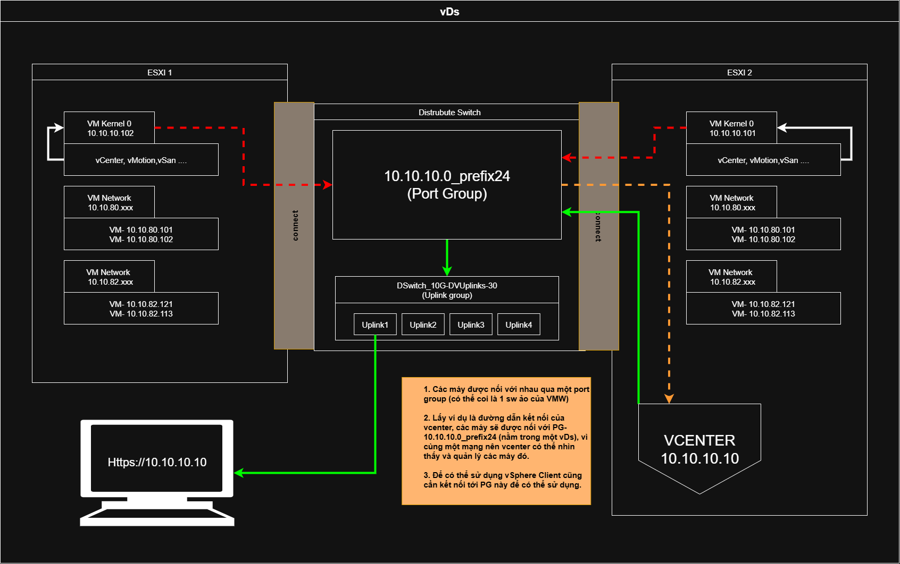

# Tài liệu về vSphere Standard Switch (vSS) và vSphere Distributed Switch (vDS)

> **Tác giả**: Hệ thống ảo hóa VMware  
> **Ngày cập nhật**: 27 tháng 10 năm 2025  
> **Phiên bản**: 1.0  

---

## 1. Giới thiệu

Trong môi trường ảo hóa VMware vSphere, **switch ảo** (virtual switch) đóng vai trò trung gian cho phép các máy ảo (VM) giao tiếp với nhau và kết nối ra mạng vật lý bên ngoài. VMware cung cấp hai loại switch ảo chính:

- **vSphere Standard Switch (vSS)** – Switch ảo tiêu chuẩn.
- **vSphere Distributed Switch (vDS)** – Switch ảo phân tán.

Mỗi loại có kiến trúc, cách quản lý và tính năng khác nhau, phù hợp với từng quy mô và yêu cầu triển khai.

---

## 2. vSphere Standard Switch (vSS)

### 2.1. Định nghĩa

**vSS** là switch ảo được cấu hình **trên từng máy chủ ESXi riêng lẻ**. Mỗi host ESXi có thể chứa nhiều vSS, nhưng **không có sự liên kết** giữa các vSS trên các host khác nhau.

### 2.2. Đặc điểm

- **Quản lý cục bộ**: Cấu hình trực tiếp trên từng host qua giao diện ESXi Host Client hoặc CLI.
- **Không yêu cầu vCenter Server**: Có thể triển khai mà không cần vCenter.
- **Cấu hình không đồng bộ**: Thay đổi trên host này **không tự động áp dụng** cho host khác.
- **Tính năng cơ bản**: Hỗ trợ VLAN, NIC teaming (theo policy), security policy (Promiscuous mode, MAC address changes...).
- **Không hỗ trợ tính năng nâng cao**: Như LACP, NetFlow, Port Mirroring tập trung, Network I/O Control (NIOC).

### 2.3. Ví dụ minh họa

Giả sử bạn có 2 máy chủ ESXi:

- **ESXi-01**: Tạo vSS tên `vSwitch0`, gắn physical NIC `vmnic0`, tạo Port Group `App-VLAN10`.
- **ESXi-02**: Bạn **phải tạo lại** `vSwitch0` và `App-VLAN10` **thủ công** với cùng cấu hình.

→ Nếu sau này bạn đổi VLAN từ 10 sang 20, bạn phải **sửa trên cả hai host** → dễ sai sót, tốn thời gian.

---

## 3. vSphere Distributed Switch (vDS)

### 3.1. Định nghĩa

**vDS** là switch ảo **phân tán**, được quản lý **tập trung thông qua vCenter Server**. Một vDS có thể bao gồm **nhiều host ESXi**, và tất cả chia sẻ **cùng một cấu hình mạng**.

### 3.2. Đặc điểm

- **Quản lý tập trung**: Cấu hình một lần trên vCenter → áp dụng cho tất cả host trong vDS.
- **Yêu cầu vCenter Server**: Không thể tạo hoặc quản lý vDS nếu không có vCenter.
- **Đồng bộ cấu hình tự động**: Giảm lỗi do cấu hình thủ công.
- **Hỗ trợ tính năng nâng cao**:
  - **LACP** (Link Aggregation Control Protocol) – kết hợp nhiều NIC thành một đường truyền logic.
  - **Private VLAN (PVLAN)** – phân vùng mạng ở lớp 2.
  - **NetFlow** – giám sát lưu lượng mạng.
  - **Port Mirroring (SPAN/RSPAN)** – sao chép lưu lượng để phân tích.
  - **Network I/O Control (NIOC)** – ưu tiên băng thông theo resource pool.
  - **Health Check** – kiểm tra cấu hình switch vật lý và ảo.
  - **Rollback cấu hình** – tự động khôi phục nếu cấu hình gây lỗi mạng.

### 3.3. Ví dụ minh họa

Bạn có cụm 4 host ESXi được quản lý bởi vCenter:

1. Tạo **vDS** tên `DVS-PROD`.
2. Gán cả 4 host vào `DVS-PROD`.
3. Tạo **Distributed Port Group** tên `DB-Tier` với VLAN 200.

→ Tất cả VM trên 4 host khi kết nối vào `DB-Tier` đều thuộc VLAN 200.

→ Nếu bạn đổi VLAN thành 300:
- Chỉ cần sửa trên **vCenter** → thay đổi **tự động áp dụng** cho cả 4 host.

---

## 4. So sánh chi tiết vSS và vDS

| Tiêu chí | **vSphere Standard Switch (vSS)** | **vSphere Distributed Switch (vDS)** |
|--------|----------------------------------|--------------------------------------|
| **Quản lý** | Trên từng host ESXi | Tập trung qua vCenter Server |
| **Yêu cầu vCenter** | Không bắt buộc | Bắt buộc |
| **Đồng bộ cấu hình** | Không – phải cấu hình thủ công | Có – tự động đồng bộ |
| **Khả năng mở rộng** | Hạn chế (phù hợp ≤ 3 host) | Tốt (hỗ trợ hàng trăm host) |
| **Tính năng mạng** | Cơ bản (VLAN, security, NIC teaming) | Nâng cao (LACP, PVLAN, NetFlow, NIOC, Port Mirroring...) |
| **Giám sát & chẩn đoán** | Hạn chế | Toàn diện (Health Check, NetFlow, thống kê theo port) |
| **Khả năng phục hồi** | Thấp | Cao (tự động rollback khi lỗi) |
| **License yêu cầu** | Bất kỳ phiên bản vSphere | **Enterprise Plus** hoặc có **vSAN/NSX** license |
| **Phù hợp** | Phòng lab, môi trường nhỏ, học tập | Môi trường sản xuất, data center, doanh nghiệp |

---

## 5. Hướng dẫn lựa chọn

### ✅ Nên dùng **vSS** khi:
- Môi trường chỉ có **1–2 host ESXi**.
- **Không có vCenter Server**.
- Ngân sách hạn chế (không mua license Enterprise Plus).
- Không cần tính năng mạng phức tạp.

### ✅ Nên dùng **vDS** khi:
- Có **nhiều host ESXi** trong cụm (cluster).
- Đã triển khai **vCenter Server**.
- Cần **quản lý tập trung**, giảm rủi ro cấu hình.
- Yêu cầu **tính năng mạng nâng cao** (LACP, NIOC, NetFlow...).
- Môi trường **sản xuất (production)**, yêu cầu độ tin cậy cao.

> 💡 **Lưu ý**: Từ **vSphere 7.0 trở lên**, VMware khuyến nghị sử dụng **vDS ngay cả trong môi trường nhỏ** nếu có vCenter, vì lợi ích về quản trị và khả năng mở rộng.

---

## 6. Kết luận

- **vSS** đơn giản, dễ triển khai, phù hợp cho môi trường học tập hoặc nhỏ lẻ.
- **vDS** mạnh mẽ, linh hoạt, hỗ trợ đầy đủ tính năng doanh nghiệp, là lựa chọn **ưu tiên trong môi trường production**.

Việc lựa chọn giữa vSS và vDS nên dựa trên **quy mô hệ thống**, **ngân sách license**, và **yêu cầu vận hành dài hạn**. Trong xu hướng hiện đại, **vDS đang dần trở thành tiêu chuẩn** cho các triển khai vSphere chuyên nghiệp.

---

## 7. Tài liệu tham khảo

- [VMware vSphere Documentation](https://docs.vmware.com/en/VMware-vSphere/)
- [KB 1010699: Differences between vSphere Standard Switch and vSphere Distributed Switch](https://kb.vmware.com/s/article/1010699)
- VMware vSphere 8.0 Networking Guide

--- 

